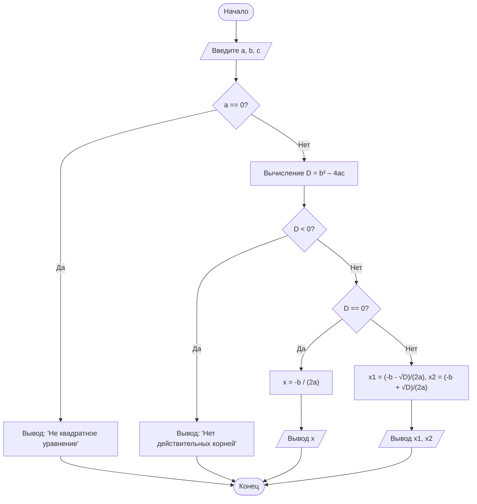

 Блок-схема алгоритма решения квадратного уравнения

## Диаграмма

# Ответ на контрольные вопросы
1. Что такое Mermaid и для чего он используется?
Mermaid — это язык разметки для создания диаграмм и схем непосредственно из текстового описания. Он используется для встраивания диаграмм (блок-схем, диаграмм последовательностей, классов, состояний, ER-диаграмм, Ганта и др.) в Markdown-документы без использования внешних графических редакторов.

2. Как вставить диаграмму в Markdown-документ?
Диаграмма вставляется с помощью блока кода с указанием языка mermaid:
` ``mermaid ... код диаграммы ... ` ``
После этого в редакторе с поддержкой Mermaid (GitHub, Typora, VS Code с расширениями) вместо кода отображается графическая схема.

3. Какие типы узлов (фигур) доступны в блок-схемах Mermaid?

Прямоугольник: [Текст] — процесс

Прямоугольник со скругленными углами: (Текст) — начало/конец (терминатор)

Ромб: {Текст} — условие (ветвление)

Овал (скруглённый): ([Текст]) — альтернативный терминатор

Параллелограмм: /[Текст]/ — ввод/вывод

Цилиндр: ([Текст]) — база данных

Круг: ((Текст)) — соединитель

4. Чем отличаются стрелки --> и -- текст -->?

--> — простая стрелка без подписи.

-- текст --> — стрелка с текстовой подписью (например, "Да" или "Нет"), которая отображается рядом со стрелкой.

5. Как изменить ориентацию диаграммы с вертикальной на горизонтальную?
В первой строке диаграммы нужно заменить направление TD (Top-Down, сверху вниз) на LR (Left-Right, слева направо):
flowchart LR
Также существуют BT (снизу вверх) и RL (справа налево).

6. Зачем нужны подграфы (subgraph)?
Подграфы нужны для группировки логически связанных узлов в блоки. Это улучшает читаемость сложных диаграмм, позволяет визуально выделить отдельные части алгоритма (например, инициализацию, основную обработку, вывод) и дать им название.

7. Какие символы нельзя использовать в идентификаторах узлов?
В идентификаторах узлов нельзя использовать пробелы и большинство специальных символов (скобки, кавычки, знаки препинания, операторы). Допускаются только буквы (латиница), цифры и символ подчёркивания _. Если внутри узла нужен пробел, его помещают в кавычки: id["Текст с пробелами"].

8. Почему важно указывать начальный и конечный узлы?
Начальный и конечный узлы (обычно овалы или скруглённые прямоугольники) обозначают чёткие границы алгоритма: откуда начинается выполнение и где оно заканчивается. Это обязательное правило структурного программирования и построения блок-схем, которое делает алгоритм полным и понятным для чтения.
